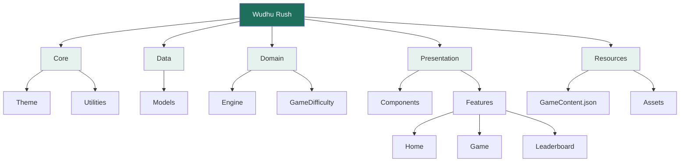
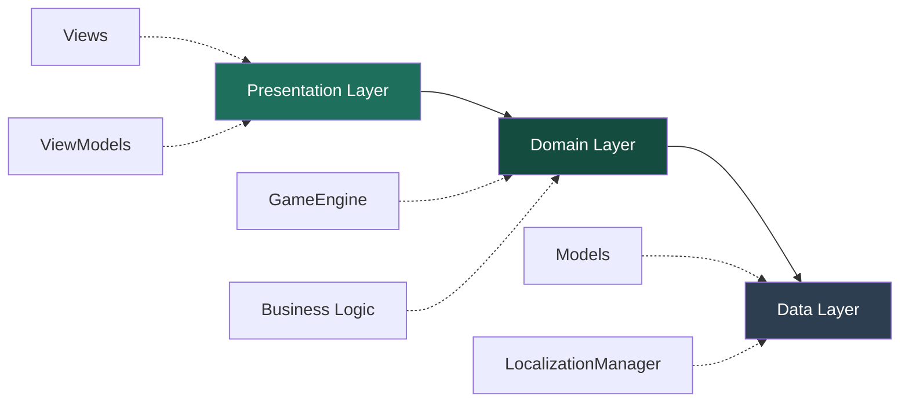
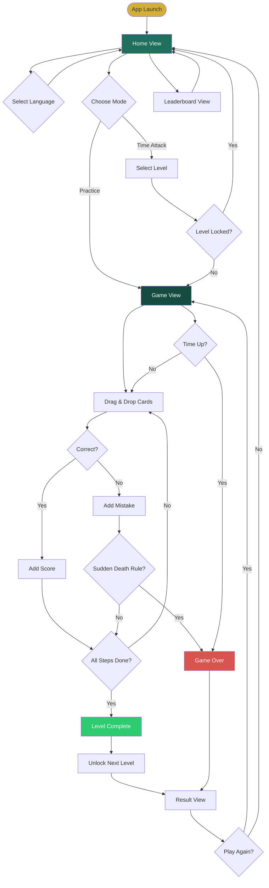
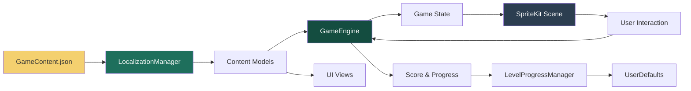
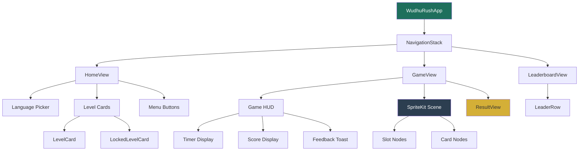

# Wudhu Rush

[](https://www.apple.com/ios/)
[](https://swift.org)
[](LICENSE)

An interactive educational game that teaches the proper sequence of Wudhu (Islamic ablution) through engaging gameplay. Built with SwiftUI and SpriteKit, featuring multi-language support and progressive difficulty levels.

## Features

### Game Modes
- **Time Attack**: Race against the clock across 10 challenging levels
- **Practice Mode**: Learn at your own pace with educational feedback
- **Progressive Difficulty**: Unlock levels by completing previous challenges

### Localization
- **6 Languages**: English, Indonesian, Malay, Japanese, Thai, Spanish
- **Dynamic Content**: All UI, levels, and feedback fully localized
- **Easy Language Switching**: Change language on-the-fly from the home screen

### Educational Features
- **Step-by-step Guidance**: Learn the correct order of Wudhu steps
- **Visual Feedback**: Immediate validation with animations and haptics
- **Distractor Challenges**: Test your knowledge by avoiding incorrect steps
- **Achievement System**: Track your progress and mastery

### Premium Design
- **Modern UI**: Clean, Islamic-themed color palette
- **Smooth Animations**: Polished transitions and micro-interactions
- **Responsive Layout**: Optimized for all iPhone sizes
- **Accessibility**: VoiceOver ready and high contrast support

## Architecture

### Project Structure



### Clean Architecture Layers



### Game Flow



### Data Flow



### Component Hierarchy



## Technical Stack

### Frameworks
- **SwiftUI**: Modern declarative UI framework
- **SpriteKit**: 2D game engine for drag-and-drop mechanics
- **Combine**: Reactive state management
- **Foundation**: Core utilities and data handling

### Key Technologies
- **@Observable**: Modern state management (iOS 17+)
- **NavigationStack**: Type-safe navigation
- **UserDefaults**: Persistent level progress
- **JSONDecoder**: Dynamic content loading
- **Haptic Feedback**: Enhanced user experience

### Design Patterns
- **MVVM**: Model-View-ViewModel architecture
- **Singleton**: Shared managers (Localization, Progress)
- **Observer**: Reactive UI updates with Combine
- **Strategy**: Different game modes with unified interface

## Getting Started

### Prerequisites
- Xcode 15.0+
- iOS 17.6+ deployment target
- macOS 13.0+ (for development)

### Installation

1. **Clone the repository**
   ```bash
   git clone https://github.com/elmeeee/WudhuRush.git
   cd WudhuRush
   ```

2. **Open in Xcode**
   ```bash
   open "Wudhu Rush.xcodeproj"
   ```

3. **Build and Run**
   - Select your target device or simulator
   - Press `Cmd + R` to build and run

### Configuration

The game content is fully configurable via `GameContent.json`:

```json
{
  "en": {
    "levels": [
      {
        "id": "L1",
        "title": "Basics 1",
        "steps": ["Intention (Niat)", "Wash Hands", ...],
        "distractors": ["Wash Feet"],
        "time_limit": 90,
        "rule": "Normal"
      }
    ]
  }
}
```

## Screenshots

### Home Screen
- Language selector with flag icons
- Scrollable level cards showing progress
- Quick access to Practice Mode and Leaderboard

### Game Screen
- Clean SpriteKit scene with drag-and-drop cards
- Real-time timer and score display
- Visual feedback for correct/incorrect placements

### Result Screen
- Win/Loss state with appropriate styling
- Score breakdown and statistics
- Retry and Home navigation options

## Game Mechanics

### Drag and Drop System
1. **Touch Detection**: Custom hit-testing for reliable card selection
2. **Visual Feedback**: Cards scale and highlight when picked up
3. **Snap to Slot**: Smooth animations when cards are correctly placed
4. **Validation**: Real-time checking against correct sequence

### Scoring System
- **Base Points**: 100 per correct step
- **Time Bonus**: Remaining seconds added to score
- **Mistake Penalty**: Score reduction for incorrect placements
- **Sudden Death**: Instant game over on first mistake (specific levels)

### Level Progression
- **Sequential Unlocking**: Complete Level N to unlock Level N+1
- **Persistent Progress**: Saved locally using UserDefaults
- **Visual Indicators**: Locked levels shown with lock icon

## Localization

### Adding a New Language

1. **Update GameContent.json**
   ```json
   {
     "fr": {
       "ui": { "home": "Accueil", ... },
       "levels": [...],
       ...
     }
   }
   ```

2. **Update LocalizationManager**
   ```swift
   struct GameContentRoot: Codable {
       let fr: LocalizedContent
       // ... other languages
   }
   ```

3. **Add to Language Picker**
   ```swift
   let languages = [
       ("fr", "🇫🇷"),
       // ... other languages
   ]
   ```

## Testing

### Unit Tests
```bash
# Run all tests
cmd + U

# Or via command line
xcodebuild test -scheme "Wudhu Rush" -destination 'platform=iOS Simulator,name=iPhone 15'
```

### UI Tests
- Automated UI testing for critical user flows
- Accessibility validation
- Localization verification

## Performance Optimization

- **Lazy Loading**: Content loaded on-demand
- **Scene Caching**: SpriteKit scene persisted to prevent recreation
- **Efficient Rendering**: Optimized node hierarchy
- **Memory Management**: Proper cleanup on view dismissal

## Contributing

Contributions are welcome! Please follow these steps:

1. Fork the repository
2. Create a feature branch (`git checkout -b feature/AmazingFeature`)
3. Commit your changes (`git commit -m 'Add some AmazingFeature'`)
4. Push to the branch (`git push origin feature/AmazingFeature`)
5. Open a Pull Request

### Code Style
- Follow Swift API Design Guidelines
- Use meaningful variable names
- Add comments for complex logic
- Keep functions focused and small

## License

This project is licensed under the MIT License - see the [LICENSE](LICENSE) file for details.

## Author

**Elmee**
- GitHub: [@elmeeee](https://github.com/elmeeee)
- Website: [https://kamy.co](https://kamy.co)

## Acknowledgments

- Islamic scholars for Wudhu guidance
- SwiftUI and SpriteKit communities
- Beta testers and early users
- Translation contributors

## Support

For questions, issues, or suggestions:
- Open an issue on GitHub
- Contact: [elmysf@yahoo.com](mailto:elmysf@yahoo.com)

## Roadmap

### Version 2.0
- [ ] Online leaderboards with Firebase
- [ ] Social sharing features
- [ ] Additional game modes (Timed Challenge, Memory Mode)
- [ ] Sound effects and background music
- [ ] iPad optimization

### Version 3.0
- [ ] Multiplayer mode
- [ ] Custom level creator
- [ ] Achievement badges
- [ ] Dark mode support
- [ ] Widget support

---

**Made with ❤️ for the Muslim community**

*"Cleanliness is half of faith" - Prophet Muhammad (ﷺ)*
